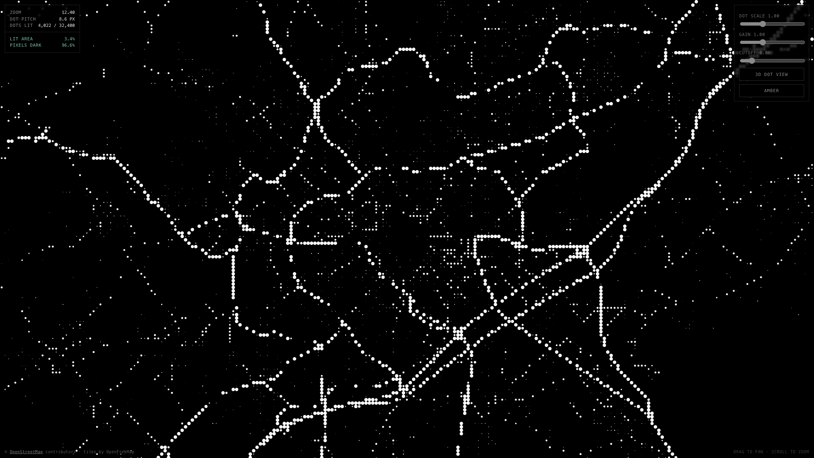

# DotWorld

**A fun personal experiment, built in a conversation with
[Claude](https://claude.com/claude-code). Nothing here is my achievement alone.**

Not affiliated with, endorsed by, or connected to OpenStreetMap, the OpenStreetMap
Foundation, OpenFreeMap, MapLibre, the World Bank, the Wikimedia Foundation,
ColorBrewer or Nothing. No claim is made over any of their work.

This project exists **only because those projects gave their work away**. It points
at them — it does not compete with them, replace them, or take anything from them.
The map data, the tiles and most of the code underneath belong to the people
credited in **[CREDITS.md](CREDITS.md)**. If you like what you see, the credit is
theirs — and [please support them](CREDITS.md#please-support-the-upstream-projects).

Live: <https://fablab503-collab.github.io/openstreetmap-dot/>

---

A world map rendered entirely as dots, on a globe.

A vector basemap is drawn offscreen, then resampled onto a lattice where each
cell's brightness becomes a dot radius. Nothing else is ever drawn. The result is
light on black — built for OLED panels, where an unlit pixel costs no power.



## Run it

Must be served over HTTP. Opening `index.html` from the filesystem will not work:
MapLibre decodes tiles in Web Workers, and browsers refuse to create workers on a
`file://` origin.

```bash
python3 -m http.server 8732
```

Then open <http://localhost:8732>. No build step, no package manager, no API key.

## How it works

**The lattice is the compression.** A viewport can never hold more than
`viewport ÷ dot pitch` dots, however much map lies underneath. Panning over a
city costs the same as panning over open ocean.

**Dot pitch follows zoom** — coarse when you are looking at a country, tight down
in the streets.

**Tiles stream by territory.** Vector tiles are fetched per tile per viewport, so
moving into new ground loads it and staying put loads nothing.

**The style is a luminance budget, not a colour scheme:**

| Feature | Value | Result |
| --- | --- | --- |
| Sea, empty space | `#000000` | unlit — no power |
| Land (country zoom only) | `#242424`→`#141414` | faint field; the coastline is its edge |
| Buildings | `#333333` | small dots |
| Minor → secondary roads | `#5a5a5a` → `#9a9a9a` | mid dots |
| Motorway, trunk, primary | `#ffffff` | full dots |

Land is lit only while zoomed out, where the silhouette has to come from
somewhere. By street zoom the ground goes black and the roads carry legibility on
their own. Water is always true black, which is both correct-looking and cheap,
since sea covers a lot of screen.

Measured: **91–99% of pixels stay dark** across every mode.

## Controls

| Control | Effect |
| --- | --- |
| `GLOBE` / `FLAT` | Sphere or mercator plane |
| `WHOLE EARTH` | Pull back until the globe is whole |
| `3D DOT VIEW` | Buildings as extrusions, height driving brightness |
| `ORBIT` | Turn the camera continuously, one revolution per minute |
| `TILT` / `BEARING` | 0–85°, 0–359° |
| `RESET NORTH` | Ease back to north |
| `AMBER` | Amber instead of white — cheaper on OLED, blue subpixel stays dark |
| `DOT SCALE` / `GAIN` / `CUTOFF` | Lattice pitch, brightness response, unlit threshold |

Drag to pan, scroll to zoom, right-drag to turn and tilt. A drag takes over from
an orbit in progress.

Defaults are calibrated by eye: `DOT SCALE 0.65`, `GAIN 2.05`, `CUTOFF 0.03`.

## Sharing a view

The URL carries the view in openstreetmap.org's own hash format, and updates as
you move:

```
#map=12.40/43.61190/3.87720
```

Bookmark it, send it, or paste a link copied from openstreetmap.org. With no hash
the map frames metropolitan France.

## Typography

Set in the Nothing visual language:

- **Dotwork** for the wordmark — a 5×7 dot face carrying Ndot 57's metrics
- **Space Mono** for every readout, label and control

Dot faces are display-only; their cells visibly merge below about 24px, so
nothing you actually read sits in one.

**On Ndot:** Nothing's own dot typeface is licensed solely for Nothing brand
materials, and its EULA forbids serving the files publicly. This repo therefore
ships Dotwork, which is metrically compatible and carries no such restriction.

## Known limits

- **Not a labelled map.** A dot lattice destroys text by design.
- **The filter does not reduce data.** A full map still renders underneath. This
  buys the look and the OLED saving, nothing else.
- **Orbit costs power** — continuous rotation means continuous redraw, which
  works against the point. It pauses automatically in a hidden tab.

## Attribution and licensing

Map data © [OpenStreetMap](https://www.openstreetmap.org/copyright) contributors,
under the Open Database License (ODbL). Attribution must stay visible in any
deployment — the app renders it itself, since the opaque dot canvas hides
MapLibre's own attribution control.

Tiles by [OpenFreeMap](https://openfreemap.org/), free and without an API key.
[MapLibre GL JS](https://maplibre.org/) is vendored under `vendor/`, BSD-3-Clause.
Dotwork, Space Mono and Space Grotesk are under the SIL Open Font License 1.1
(`fonts/Dotwork-OFL.txt`).
