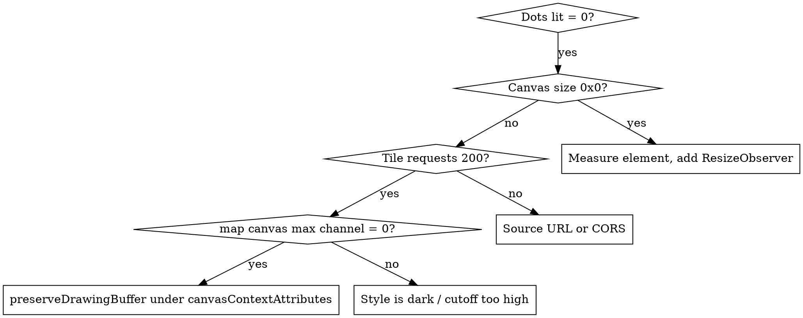

# Dots: maps rendered as a dot lattice

## Overview

Draw a normal vector map offscreen, then resample it to a lattice where each
cell's luminance becomes a dot radius. Nothing else is drawn.

**Core principle: the lattice IS the compression.** A viewport can never hold
more than `viewport ÷ pitch` dots, no matter how much map sits underneath.
A 1600×900 view at 8px pitch is ~22,000 dots whether it is over Paris or over
open ocean. Cost is bounded by screen size, not by data density.

**For OLED, treat the style as a luminance budget, not a colour scheme.** A
black pixel is an unlit pixel. Spend brightness only on what makes the map
legible and leave everything else at `#000000`.

## When to Use

- Dot-matrix / halftone / Ndot map aesthetics
- OLED or e-ink UIs where lit-pixel count drives power
- A map that must stay cheap while panning
- Debugging a MapLibre canvas that reads back black (see Gotcha 3)

**Not for:** maps needing labels, precise reading, or accessibility as the
primary concern. A dot lattice destroys text and fine geometry by design.

## The Three Gotchas

These are the whole reason this skill exists. Each fails *silently*.

### 1. cdnjs ships no MapLibre JavaScript

The cdnjs `maplibre-gl` package contains **only CSS**. Every `.js` path 404s —
`maplibre-gl.js`, `maplibre-gl.min.js`, `dist/maplibre-gl.js`, all of them.
The CSS returns 200, which makes it look like the right library.

Use jsDelivr npm, or vendor locally:

```
https://cdn.jsdelivr.net/npm/maplibre-gl@<v>/dist/maplibre-gl.mjs
                                          dist/maplibre-gl-shared.mjs
                                          dist/maplibre-gl-worker.mjs
                                          dist/maplibre-gl.css
```

### 2. MapLibre v6 is ESM-only with named exports

No UMD build, no global. `<script src>` leaves `maplibregl is not defined`.
There is also no default export, so `import maplibregl from` throws
*"does not provide an export named 'default'"*.

```js
import * as maplibregl from './maplibre-gl.mjs';   // the only form that works
```

### 3. `preserveDrawingBuffer` moved — and its absence is invisible

In v6 it lives under `canvasContextAttributes` and defaults to `false`. The
old top-level option is **ignored without warning**. Without it the drawing
buffer is wiped after compositing, so `drawImage(map.getCanvas(), …)` returns
an all-black frame while the map itself renders perfectly.

```js
new maplibregl.Map({
  canvasContextAttributes: {
    preserveDrawingBuffer: true,   // required to sample the frame
    antialias: false               // the lattice resamples anyway
  }
});
```

## Debugging a black dot map

Everything reports success in this failure: tiles return 200, no console
errors, WebGL is real hardware, `idle` fires. Only pixel values reveal it.



The decisive probe — draw the map canvas into a 2D canvas and read it:

```js
const t = document.createElement('canvas');
t.width = t.height = 64;
const x = t.getContext('2d');
x.drawImage(map.getCanvas(), 0, 0, 64, 64);
const d = x.getImageData(0, 0, 64, 64).data;
let max = 0;
for (let i = 0; i < d.length; i += 4) max = Math.max(max, d[i], d[i+1], d[i+2]);
// max === 0 with tiles loading => Gotcha 3
```

**Do not filter fetch errors out of `map.on('error')`.** A blanket
`/Failed to fetch|404/` filter hides a dead tile source — the exact failure
that produces a black screen. Ignore only tile 404s: `/404/.test(m) && /\.pbf/.test(m)`.

## The halftone pass

```js
const pitch = clamp(18 - (zoom - 3), 3.5, 18) * scale;  // out = coarse, in = fine
const cols = Math.ceil(canvas.width / (pitch * DPR));
small.width = cols; small.height = rows;
small.getContext('2d').drawImage(map.getCanvas(), 0, 0, cols, rows); // box filter = the compression
// per cell: L = luma(px); if (L <= cutoff) continue;   // stays unlit
//           r = ((L - cutoff) / (1 - cutoff)) ** (1/gain) * pitch/2
```

Batch every dot into **one** `ctx.beginPath()` / `arc()` / `fill()`. Redraw
only on `map.on('render')`, so a stationary map costs nothing.

## Style as a luminance budget

| Feature | Value | Becomes |
|---|---|---|
| Background, empty land | `#000000` | unlit, zero power |
| Water | `#101010` | faint texture |
| Buildings | `#333333` | small dots |
| Minor → secondary roads | `#5a5a5a` → `#9a9a9a` | mid dots |
| Motorway, trunk, primary | `#ffffff` | full dots |

Never halftone a light basemap for an OLED target — it inverts the goal and
lights most of the panel. Amber (`#ffb000`) costs less than white on most
OLEDs since the blue subpixel stays dark.

3D is a z-value, not a second renderer: switch buildings to `fill-extrusion`,
map `render_height` to brightness, and the same lattice reads as relief.

## Environment constraints

- **Must be served over HTTP.** MapLibre decodes tiles in Web Workers, which
  browsers refuse to create from a `file://` origin. Opening the HTML directly
  yields a permanently black screen.
- **Cannot run as a published Artifact.** The artifact CSP blocks fetch/XHR to
  non-allowlisted hosts, so tile requests never leave the page.
- OpenFreeMap needs no API key and sends `access-control-allow-origin: *`.
  Tiles: `https://tiles.openfreemap.org/planet` (TileJSON → `{z}/{x}/{y}.pbf`).
  Attribution to OpenStreetMap contributors is required and must stay visible —
  render it yourself, since an opaque dot canvas hides MapLibre's own control.

## Measured results

Montpellier, 2056×1158, defaults `gain 1.0` / `cutoff 0.06`:

| View | Pitch | Dots lit | Lit area | Dark |
|---|---|---|---|---|
| z12.4 wide | 8.6 px | 4,022 / 32,400 | 3.4% | 96.6% |
| z18.5 street | 3.5 px | 99,605 / 194,628 | 0.9% | 99.1% |
| z16.4 3D, 58° | — | 118,307 / 176,085 | 5.3% | 94.7% |

Report lit-area percentage in the UI. It makes the power goal a number you can
tune against instead of a judgement call.

## Common Mistakes

- Sizing the canvas from `innerWidth` once at load — a hidden or unlaid-out
  container leaves a 0×0 buffer that silently draws nothing and never
  recovers. Measure the element and attach a `ResizeObserver`.
- Painting an opaque canvas over the map without forwarding interaction. Set
  `pointerEvents:'none'` on the dot canvas so the map still receives drags.
- One `arc()`+`fill()` per dot. Batch into a single path.
- Letting error messages cascade: the *first* fault is the useful one.
- Assuming the halftone filter reduces data. It does not — it still renders a
  full map underneath. It buys the look and the OLED saving, nothing else. A
  true low-data version needs a custom renderer over raw MVT geometry.

## Reference Implementation

`dotmap/prototype/` in this repo — working Montpellier map with zoom-driven
pitch, 3D dot view, live lit-area HUD, and MapLibre vendored locally.
Serve it: `python3 -m http.server 8731`.
