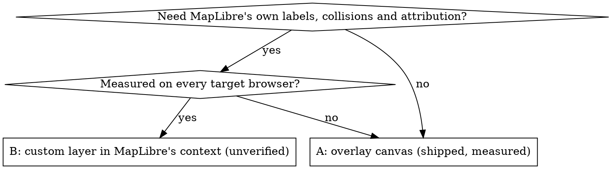

# DotWorld: maps drawn as dots

## Overview

A vector map (MapLibre GL JS v6 + OpenFreeMap tiles) is rendered, then resampled
onto a lattice where each cell's brightness becomes a dot's radius. Two principles
carry the whole project:

1. **The style is a luminance budget.** On OLED a lit pixel costs power, so
   brightness goes only where it buys legibility.
2. **Measure, don't estimate.** Nearly every unmeasured assumption on this project
   turned out wrong at least once — including two of its own benchmark theories.

Live: https://fablab503-collab.github.io/openstreetmap-dot/ — paths, layout,
defaults and open items are in `references/project.md`.

## When to use

- Extending or debugging DotWorld.
- Any halftone or dot-matrix map, or any page that puts a canvas on top of MapLibre.
- Colouring data that must survive resampling; population ramps on dark grounds.
- Publishing a static MapLibre map to GitHub Pages.

**Not for** maps whose point is reading text or precise geometry — the lattice
destroys both by design.

## Choose the architecture before writing code

| | A — overlay canvas (DotWorld) | B — custom layer inside MapLibre |
|---|---|---|
| Frame source | `texImage2D(map.getCanvas())` into a separate WebGL2 canvas; needs `preserveDrawingBuffer` | `copyTexSubImage2D` mid-render in MapLibre's own GL context |
| Labels | A **third canvas on top** — MapLibre `symbol` layers are hidden under the opaque overlay | A `symbol` layer after the custom layer; MapLibre handles collisions and the globe's far side |
| Attribution | MapLibre's control is hidden too — **render your own** | MapLibre's control works |
| Status | Measured in WebKit on an M2 Pro: upload ~0 ms, draw 0.1–0.5 ms | Depends on MapLibre restoring GL state after `render()` — internal, undocumented; breaks with terrain |

Code for both: `references/architecture.md`.

## Rules learned the hard way

| Rule | Evidence |
|---|---|
| `import * as maplibregl from '…/maplibre-gl.mjs'` (jsDelivr or vendored) | v6 is ESM-only with named exports; cdnjs's `maplibre-gl` package ships **only CSS** |
| `canvasContextAttributes: { preserveDrawingBuffer: true }` | Top-level `preserveDrawingBuffer` is silently ignored in v6 — tiles load, errors are silent, every readback is black |
| Serve over HTTP | Tile workers refuse a `file://` origin — permanent black screen |
| Draw the dots in a fragment shader | Canvas2D arcs: 18.3 ms/frame at street zoom, ~30 ms at 180k dots. CPU pixel stamping: 50–100 ms. Shader: 0.1–0.5 ms, flat in dot count |
| Never read the frame back on a timer while the map moves | Readback measured anywhere from **1 ms to 55 ms**. Count at rest, or read asynchronously (PBO + `fenceSync`) |
| Never let ground or sea be pure black | Open water became a total void — 0 dots, max channel 0 — and read as a broken app. Floors: sea `#0f0f0f`, land ≥ `#151515` |
| On black, data brightness must rise with the value | Published YlOrRd runs light→dark: luminance *falls* 0.844 → 0.047 as population rises, so the biggest cities vanish. Reverse it (or viridis from t≈0.3); use a log scale across orders of magnitude |
| Separate data from context by chroma | Grey cells take the chosen dot colour; saturated cells keep their hue, normalised to full brightness; basemap dimmed to ~0.38 while data shows |
| Re-arm `requestAnimationFrame` **before** drawing | Re-arming after means one exception stops rendering for good |
| Guard MapLibre's lifecycle | `getProjection()` is `undefined` until the style loads; `let`s read in the render loop must be declared above the loop (TDZ); `rotatestart` fires for your own `easeTo` — check `e.originalEvent`; re-fit bounds when a zero-size container first gets a size |
| Text never goes through the lattice | Letterforms turn to mush at any usable pitch — draw names above the dots |
| Keep element ids unique | A slider that shared `id="s-pop"` with a counter turned the filter into `>= null` and hid every commune |

## Measuring

Real frames cannot be sampled reliably in a hidden or background tab — and Claude's
Browser pane usually is one: about 2 animation frames per 800 ms, timers clamped to
≥ 1 s, CSS transitions frozen, the style sometimes never loading. The symptom is
every sample reading the same value, or a HUD stuck at `0 dots`.

1. Benchmark synchronously, forcing `gl.finish()` per stage (`window.__bench(n)`).
2. Prove the source frame has content first (max channel > 0) — a black frame
   flatters every renderer.
3. Compare against the fallback (`?renderer=cpu`).
4. When two results disagree, test the explanation directly before building on it.

Numbers, traps and the async-readback pattern: `references/measuring.md`.

## Data and colour

- Tiles carry **no population** — the `place` layer has only `capital, class,
  iso_a2, name, rank`. Bring your own data.
- Wikidata `wdt:P31 wd:Q484170` **drops Paris** (special status since 2019,
  Q22923920) — union it in. INSEE's API Géo is the official French source.
- 195 capitals = 193 UN members + Vatican + Palestine. A truthy "member of the UN"
  also matches **historical** memberships and lets Taiwan in (its seat passed to the
  PRC in 1971) — DotWorld once shipped Taiwan instead of Vatican City and still
  totalled 195. Require a membership with no end date *and* a current, undissolved
  sovereign state. 7 states have several seats; capital populations mix city-proper
  and municipality figures.
- A "live" population counter is a projection — label it as one.
- Categorical palettes must pass a colour-vision check; two of DotWorld's first
  three failed (green vs gold ΔE 2.5 under protanopia).

Queries and reproducible scripts: `references/data.md`, `scripts/`.
Ramps, budgets and palettes: `references/colour.md`.

## Publishing and credits

- GitHub Pages: `.nojekyll`, relative paths, confirm `.mjs` is served as
  `text/javascript`, and verify the *new content* is live with a cache-busting
  query — a successful push is not a live site.
- OpenStreetMap attribution must stay visible. An MIT licence can cover only your
  own code — it cannot relicense ODbL or CC BY data. Nothing's Ndot typeface is
  brand-only: ship Dotwork (OFL) instead.
- DotWorld's standing rule: every update is pushed with README, CREDITS and
  CHANGELOG updated in the same commit.

`references/publishing-and-credits.md`.

## Common mistakes

| Mistake | What happens | Fix |
|---|---|---|
| `<script src="…/maplibre-gl.js">` | 404, then `maplibregl is not defined` | ESM import with named exports |
| Top-level `preserveDrawingBuffer` | Every read of the frame is zero | Put it in `canvasContextAttributes` |
| Per-dot `arc()` in Canvas2D | 18–30 ms per frame | Fragment shader |
| Timer-driven readback while moving | Hitches several times a second | Count at rest, or async PBO |
| `#000` ground and sea | Blank screen over water | Faint floors the CUTOFF can remove |
| YlOrRd as published on black | Biggest values are darkest | Reverse it, or viridis |
| `symbol` layer under an overlay canvas | Labels invisible | Label canvas on top, or architecture B |
| rAF sampling in a hidden tab | Identical stale samples | Synchronous bench plus a content check |
| Treating a push as "live" | Old cached build still served | Poll for the new content with `?v=` |
